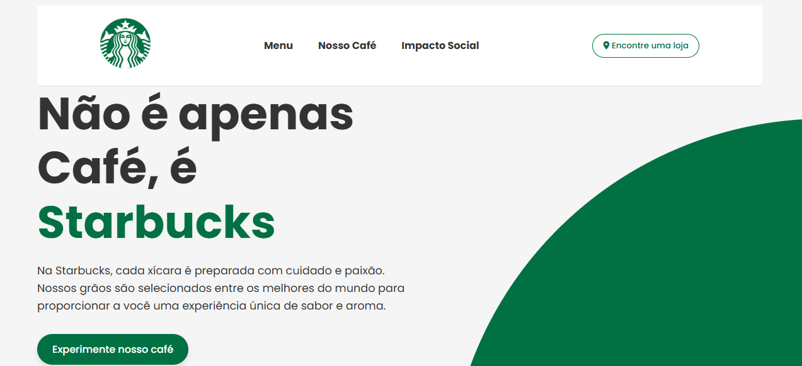

# ☕ Starbucks Landing Page

A visually appealing and responsive landing page inspired by Starbucks. This project focuses on clean layout, smooth transitions, and product showcase with interactive elements.



## 🔍 Features

- ✅ Fully responsive design for mobile and desktop
- 🌈 Smooth color transitions based on user selection
- 📸 Interactive image switcher for drinks
- ✨ Clean layout with modern CSS effects
- ⚙️ Simple JavaScript DOM interactions

## 🛠️ How to Open the Project

```bash
# Clone the repository
git clone https://github.com/bruno-moura-2804/StarbucksPage.git

# Navigate to the project folder
cd StarbucksPage

# Open index.html in your browser
```

🧰 Technologies Used

HTML5

CSS3

JavaScript (Vanilla)

Google Fonts

Responsive Web Design
